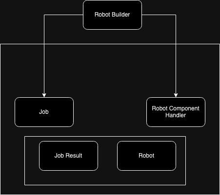

# micro-batch

## Overview

In this project, I'm simulating the assembly of robots using a series of classes and functions. The goal is to implement a micro-batching system where individual tasks, represented as components needed to assemble a robot, are grouped together and processed in batches. Upon completion of each batch, a special number is assigned to the assembled robot.

### Components

  Job: Represents individual tasks in the assembly process.
  JobResult: Represents the result of a job, including data and error information.
  RobotComponent: Represents a component needed to assemble a robot.
  Robot: Represents a fully assembled robot, consisting of components.
  RobotBuilder: Manages the assembly process, batching components together, and assigning special numbers to assembled robots.

### Language and Tools

  Language: JavaScript
  Runtime Environment: Node.js
  Testing Framework: Jest

### Usage

  Install Node.js if not already installed from Node.js Downloads.
  Clone this repository to your local machine.
  Navigate to the project directory in your terminal.
  Run npm install to install project dependencies.
  Run npm test to execute the tests and verify functionality.
  Run node robotExample.js to run the simulation and see the assembly process in action.

### Initial Concept for the Development

### Author

Francisco Arrieta

